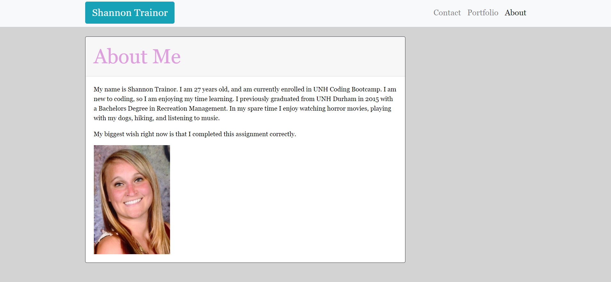

# Bootstrap Portfolio

### Overview
    My portfolio provides information on myself, who I am, what I like to do, and a way to contact me. I made this portfolio in order to practice bootstrap, HTML, and CSS. To access my portfolio, you will only need a link, which can be found in the "Deployed" section of this ReadMe.

### Useage
Below is a look at the About Me page of my portfolio.
 

### Deployed Here
You can fine my responsive portfolio located at the link below.
https://shannontrainor.github.io/responsive-portfolio/